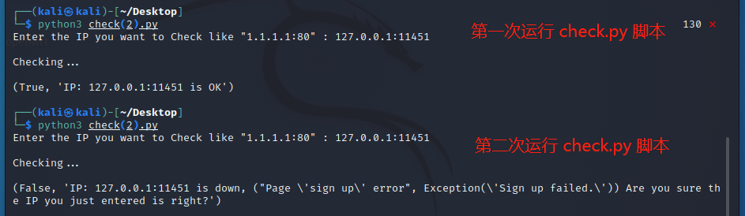

# Microbo

本项目是一个留言发帖网站。

## 功能清单

- 用户注册和登录系统
  
  - 允许用户注册到系统
    
    - 用户名强制要求为电子邮件地址
      
      - 电子邮件地址不可重复
    
    - 要求用户注册昵称
      
      - 昵称不可重复
    
    - 用户口令长度限制在 8 个字符以上
    
    - 对用户输入的口令进行强度校验，禁止使用弱口令
  
  - 使用合法用户名和口令登录系统
  
  - 使用散列值存储用户口令
    
    - 存储的口令即使被公开，也无法还原/解码出原始明文口令

- 留言板系统
  
  - 允许用户在 home 页面添加留言
  - 允许用户删除自己的留言
  - 允许用户查看其他用户的留言

- 个人资料系统
  
  - 允许用户通过点击导航栏中 profile 进入个人资料页面
  
  - 允许用户在 home 页面通过点击自己/其他用户头像/用户名的方式访问对应用户的个人资料页面
  
  - 允许用户在个人资料页面查看对应用户的头像、用户名和留言
    
    - 个人资料页面会因用户的不同而显示不同的内容
  
  - 允许用户在自己的个人资料页面点击并进入不同的个人资料修改页面
    
    - 允许用户在 edit 页面修改自己的 `email` 和 `nickname`
      
      - 电子邮件地址和昵称不可与更改之前相同
      - 电子邮件地址和昵称不可与其他用户重复
    
    - 允许用户在 change-password 页面修改自己的 `password`
      
      - 口令的要求与注册时相同
    
    - 允许用户在 upload 页面上传并修改自己的头像
      
      - 头像图片格式要求为 `jpg、png、bmp` 中的任意一种
        
        - 对文件格式进行白名单和魔术头校验
      
      - 头像图片实现文件秒传：服务器上已有的文件，客户端禁止重复上传

## 本项目用到的关键技术

- 使用 flask 框架编写

- 在 web 应用中内置了 flask 框架的 SSTI 漏洞，并以此作为找到 flag 的途径

- 可以使用 docker-compose 快速搭建漏洞环境
  
  - 提供了修改 flag 的脚本
  - 提供了验证 flag 存在的脚本

- 提供了修复此 SSTI 漏洞的补丁

## 快速上手体验

本工程有两种安装方式，首先拉取项目文件并安装相关依赖：

```
# 请确认您至少安装了 python 3+ 版本
git clone <repo-url>
cd ./MicroBo
pip install -r requirements.txt # 安装依赖
```

1. 通过 `docker` 方式部署：
   
   ```
   docker-compose up -d
   ```
   
   打开浏览器访问： [http://127.0.0.1:11451/](http://127.0.0.1:11451/) 即可快速体验系统所有功能。

2. 不通过 `docker` 方式部署：
   
   ```
   python main.py
   ```
   
   打开浏览器访问： [http://127.0.0.1:5000/](http://127.0.0.1:5000/) 即可快速体验系统所有功能。

## 依赖环境安装补充说明

- 国内特殊网络环境条件下，安装 `docker` 和从 `Docker Hub` 拉取基础镜像可能会无法正常完成，建议使用 **可靠** 镜像源和缓存。推荐：
  - [安装 docker 主程序指南](http://mirrors.ustc.edu.cn/help/docker-ce.html)
  - [加速访问 Docker Hub 指南](http://mirrors.ustc.edu.cn/help/dockerhub.html)

## 演示

点击图片查看演示视频

[](https://www.bilibili.com/video/BV1T14y1b7kH)

## 附录

- 使用 `check.py` 验证 WEB 程序是否正常工作
  
  ```bash
  python check.py
  ```

  > 注：该脚本因为在测试注册页面时，虚构了一个邮箱地址为 `123@abc.com` , 昵称为 `nickname_test` 的用户作为测试对象，又因为网站设置已注册的邮箱和昵称不可再次用来注册新用户，所以该脚本只可运行第一次，第二次及之后的运行会提示 `Page 'sign up' error` , 如下图所示:
  > 

  > 另注：可以通过修改 `check.py` 脚本中的邮箱地址和昵称，或者停止服务后再删数据库重启来避免这个问题

- 使用 `Break_it` 文件夹中的 `exp.py` 以获取 flag 文件
  
  ```bash
  python exp.py
  ```
