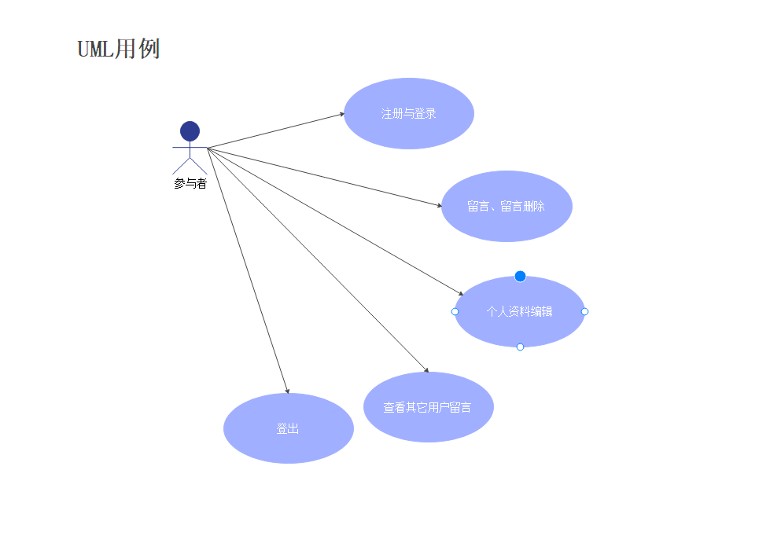
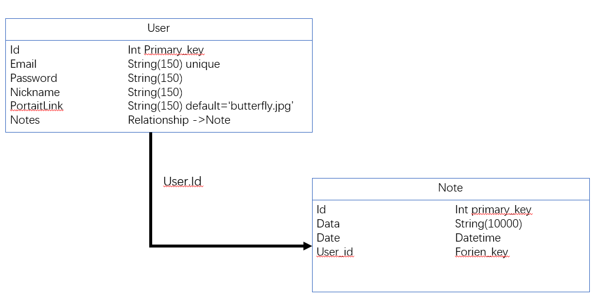

# 需求分析与设计文档

## 一、引言

#### 1.1 编写目的：

编写本需求分析与设计文档旨在根据本次“小学期”“漏洞攻防实训”的情境，即“BIBIFI”的总体要求进行漏洞靶标环境的构建、验证和修复等行为。本文档面向的读者主要是开发过程中的开发人员，通过明确产品需求和系统功能的方式，制定开发时的方案和细节，希望能使开发工作更明确、具体地执行。

#### 1.2 项目背景：

微博是当代人社交活动的重要载体。我们希望以类似“微博“的形式，制作一个轻量级的、交互式的博客，并且在其中以特定的、有线索的形式进行有漏洞的靶标环境的虚拟仿真。通过这种方式，我们希望建设一个可用的、有实际使用场景的网站，并且同时能满足对其进行漏洞利用和攻击的需求。

#### 1.3 项目参与者：

（有序的名字）（目前排序只是我复制的contributors的顺序，后续调整排序和任务内容）

人员分工说明如下：

| github用户名        | 分工职责                                               | 贡献率（百分比） |
| ---------------- | -------------------------------------------------- |:--------:|
| AltSuperBlade    | 统筹整个项目。负责项目需求制定，架构规划，前端开发协调，网页功能实现。                |          |
| egoisticlily     | 编写需求分析、设计文档、API接口设计说明。部分页面UI设计，开发前端页面。             |          |
| Itzhakrees       | FixIt阶段。后端服务部署。docker。 |          |
| tbc              | BreakIt阶段。exp、poc的编写。                              |          |
| caomoumou-github | 开发前端页面。                                            |          |

## 二、开发目标

#### 2.1 核心功能：

页面本身的实现，包括用户登录与注册页面、所有人的留言页面、个人资料页面、编辑个人信息页面、更改密码页面、修改头像页面。包含在其中的额外功能还有：留言的删除（包括在所有人的留言页面和个人资料页面）、点击id或者头像进行对应用户个人页面跳转等符合用户操作逻辑的、维持网页运转的基础功能。除此之外，还有预留漏洞相关功能的功能的实现。

#### 2.2 用例分析

游客首次注册时，将会强制要求进行注册，注册成功后系统会分配用户id标识用户，加入用户数据库并获得用户权限。只有在注册后才会有浏览和发博删博等的权限，完成注册后用户可以具有对自己账号功能的完整使用权力。

用例图如下：

#### 2.3 数据库设计：

有数据库结构设计图如下：

## 三、验收方式：

小组按计划完成页面的开发，将要提交的页面作品应用到具体的情景，通过对小组所开发的网页和设置的flag进行验证，判断是否达到预期的要求与目的。

| 编号  | 功能            | 功能属性   |
| --- | ------------- | ------ |
| 1   | 用户登录          | 核心功能   |
| 2   | 用户注册          | 核心功能   |
| 3   | 用户留言          | 核心功能   |
| 4   | 留言删除          | 核心功能   |
| 5   | 个人主页          | 拓展     |
| 6   | 查看其他用户的留言和主页  | 拓展     |
| 7   | 一定程度修改个性化设置   | 拓展     |
| 8   | 验证漏洞存在，找到flag | 额外重要目标 |

## 四、评定方式

1. 优秀：界面整洁友好且符合常理设计，预期功能与实际需求都完美实现与满足，功能新颖且有较强创新。

2. 良好：界面整洁友好，符合常理设计，实现预期功能和满足实际需求。

3. 合格：界面整洁且友好，基本实现预期功能和满足实际需求。

4. 不合格：界面难懂，操作不便，基本功能并未实现。
